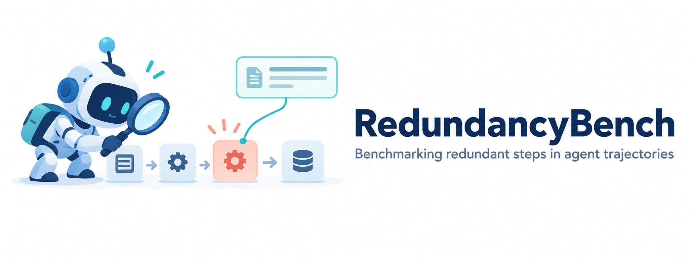
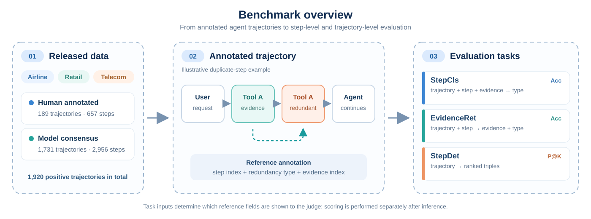

<h1 align="center">
  
</h1>

<p align="center">
  <a href="#overview">Overview</a> ·
  <a href="#benchmark">Benchmark</a> ·
  <a href="#evaluation">Evaluation</a> ·
  <a href="#run-the-benchmark">Run the benchmark</a> ·
  <a href="data/">Dataset</a>
</p>

> A benchmark for finding, classifying, and explaining redundant tool interactions in LLM agent trajectories.

## Overview

An agent can complete a task while still making tool calls that add no necessary information or action. Final task success alone does not show **which interaction was avoidable**, **why it was redundant**, or **what evidence supports that judgment**. RedundancyBench turns these questions into three evaluation tasks for LLM judges, ranging from classifying a known step to finding all redundant steps in a full trajectory.

The benchmark supports research on step-level agent evaluation in three ways:

- **Localize avoidable work:** identify the assistant tool interaction, rather than assigning only a trajectory-level label.
- **Explain the judgment:** distinguish four kinds of redundancy and require a reference to supporting evidence.
- **Compare judge capabilities:** measure classification, evidence retrieval, and full detection under different amounts of information revealed to the model.

<p align="center">
  
</p>

## Benchmark

RedundancyBench evaluates **assistant tool interactions** in recorded trajectories from the Airline, Retail, and Telecom domains of [tau2-bench](https://github.com/sierra-research/tau2-bench). Each reference annotation identifies a redundant step, assigns a type, and points to evidence in the same trajectory. The four types describe different reasons an interaction may not contribute to effective task completion:

| Redundancy type | What the judge must distinguish |
| --- | --- |
| **Duplicated Step** | An earlier valid interaction already supplied the needed information or operation. |
| **Abnormal Step** | A transient external or tool failure was superseded by a later successful retry. |
| **Incorrect Step** | The action was unjustified given the request, policy, or information available when it occurred. |
| **Exploratory Step** | A reasonable search or diagnosis did not contribute necessary information to the effective path. |

The three tasks vary what the judge is told. All use the full observable trajectory and the applicable domain policy; the original message indices are preserved so steps and evidence can be matched exactly.

| Task | Given to the judge | Prediction | Metric |
| --- | --- | --- | --- |
| **StepCls** (`classify`) | Trajectory, reference step, reference evidence | Redundancy type | **StepCls Acc** |
| **EvidenceRet** (`retrieve`) | Trajectory, reference step | Evidence indices **and** redundancy type | **EvidenceRet Acc** |
| **StepDet** (`detect`) | Trajectory only | Confidence-ranked `(step, evidence, type)` predictions | **P@1, P@5, P@10**, **Avg P@K** |

StepCls and EvidenceRet evaluate one labeled step per request. StepDet asks the judge to discover redundant interactions without being shown their locations and evaluates one complete trajectory per request. The task instructions and label definitions are fixed in [`prompts.py`](redundancybench/LLM_judge/prompts.py).

## Evaluation

**StepCls Acc** is the fraction of reference steps whose type is predicted correctly. **EvidenceRet Acc** counts a step only when both its type and complete evidence reference are correct; the denominator is again all reference steps. Complete pairs in joint evidence may be reordered, but the indices within each pair must remain intact.

For StepDet, let `n_i` be the number of predictions returned for trajectory `i`. Rank them by confidence and inspect the first `min(K, n_i)`. Let `h_i(K)` count exact matches on **step, evidence, and type**, with at most one hit per step. The benchmark reports the macro mean across trajectories:

```text
P_i@K    = h_i(K) / min(K, n_i)       
P@K      = mean_i(P_i@K)
Avg P@K  = mean(P@1, P@5, P@10)
```

The default cutoffs are `K = 1, 5, 10`. Repeated predictions for the same step still occupy ranking slots, but only the first prediction with valid confidence can earn a hit. Entries with invalid confidence occupy non-scoring slots ahead of numeric confidences, following the original experiment protocol. Failed, truncated, or unparseable replies remain in the denominator and score zero. The runner records predictions; [`evaluation.py`](redundancybench/evaluation.py) scores completed result files separately, without another model call.

## Run the benchmark

### Requirements

Use Python **3.10+** and an OpenAI-compatible `/chat/completions` endpoint. The runner and evaluator use only the Python standard library; [`requirements.txt`](redundancybench/requirements.txt) records that no third-party packages are needed. Run the following commands from the repository root.

### Check the release and preview prompts

```bash
python3 -m unittest discover -s redundancybench/tests -v

python3 -m redundancybench.LLM_judge.run_experiment \
  --model demo-model --base-url https://your-endpoint.example/v1 \
  --dataset human_annotation --limit 1 --dry-run \
  --output-dir results/preview
```

The preview writes one prompt per task and makes no API request. To run a one-unit-per-task smoke test, provide your endpoint and API key:

```bash
export OPENAI_API_KEY="your-api-key"
export MODEL_BASE_URL="https://your-endpoint.example/v1"

python3 -m redundancybench.LLM_judge.run_experiment \
  --model demo-model --base-url "$MODEL_BASE_URL" \
  --dataset human_annotation --limit 1 --output-dir results/smoke
```

### Run inference and score results

Remove `--dataset` and `--limit` to use both released subsets, all three domains, and all three tasks:

```bash
python3 -m redundancybench.LLM_judge.run_experiment \
  --model demo-model --base-url "$MODEL_BASE_URL"

python3 -m redundancybench.evaluation \
  results/demo-model/demo-model_classify.json \
  results/demo-model/demo-model_retrieve.json \
  results/demo-model/demo-model_detect.json \
  --output results/demo-model/evaluation.json
```

A complete run makes **3,613 StepCls + 3,613 EvidenceRet + 1,920 StepDet = 9,146** model requests. By default, requests include the domain policy, use temperature `0`, and allow up to `32,768` output tokens. StepDet does not cap the number of predictions. Use `--task`, `--dataset`, `--domain`, or `--limit` to select a smaller run; use `--resume` after an interruption. For endpoints that require another token-limit field, set `--max-tokens-param max_completion_tokens`. Keep these settings consistent across compared models.

The runner saves raw responses, parsed predictions, reference annotations, prompt hashes, and request settings under `results/<model>/`. The offline report includes overall, domain, and subset scores and rejects incomplete result files. Use `--ks 1,5,10` to change StepDet cutoffs without rerunning inference.

## Data and provenance

The release contains **1,920 positive trajectories** and **3,613 labeled redundant steps**. It combines a human-annotated subset with a larger model-consensus subset; all released trajectories have at least one labeled redundant step, so StepDet P@K describes the **positive-trajectory setting**.

| Domain | Human trajectories | Human-labeled steps | Model-consensus trajectories | Model-consensus steps |
| --- | ---: | ---: | ---: | ---: |
| Airline | 38 | 134 | 165 | 483 |
| Retail | 40 | 99 | 412 | 744 |
| Telecom | 111 | 424 | 1,154 | 1,729 |
| **Total** | **189** | **657** | **1,731** | **2,956** |

The model-consensus trajectories come from five generation models. Their reference labels were retained when at least two of three annotation models agreed; **the 1,731 trajectories were not individually human-verified**. Scores are reported separately by subset as well as overall. Each domain contains `final_traces.json` and `annotation.json`. Join the human subset by `task_id` and the model-consensus subset by `trajectory_id`. The [human subset README](data/human_annotation/README.md) and [model-consensus subset README](data/automated_annotation/README.md) document the released fields and provenance.

## Repository layout

```text
assets/                                README banner and benchmark figure
data/                                  Released trajectories and annotations
redundancybench/
  data_loader.py                         Shared dataset loading and index normalization
  LLM_judge/
    prompts.py                           Task instructions and trajectory formatting
    response_parser.py                   Task-specific response parsing
    runner.py                            Model requests and result recording
    run_experiment.py                    Experiment CLI
  evaluation.py                          Offline scoring and report CLI
  requirements.txt                       Python version; no external dependencies
  tests/                                 Release and metric checks
```
